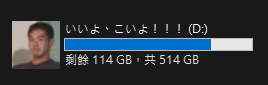

# Tadokoro's Drive (田所さんのバーチャルドライブ)

這是一個容量高達 514 GB（剩餘空間 114 GB）的虛擬硬碟（VHD），經過高度壓縮後只有 62.8 MB。

## 📌 特色 (Features)
* **總容量：** 514 GB (符合王道徵收容量)
* **可用空間：** 114 GB
* **彩蛋：** 內建 `autorun.inf` 與專屬 `ico` 圖示，掛載後即可體驗野獸先輩的惡臭（？）

## 💾 下載與使用說明 (Usage)
1. 前往 [Releases](../../releases) 下載壓縮包。
2. 解壓縮得到 `Tadokoro.vhd`。
3. 在 Windows 系統中，按 `Win + X` 選擇「磁碟管理」。
4. 點選上方選單「動作」->「掛載 VHD」，選擇該檔案即可。
